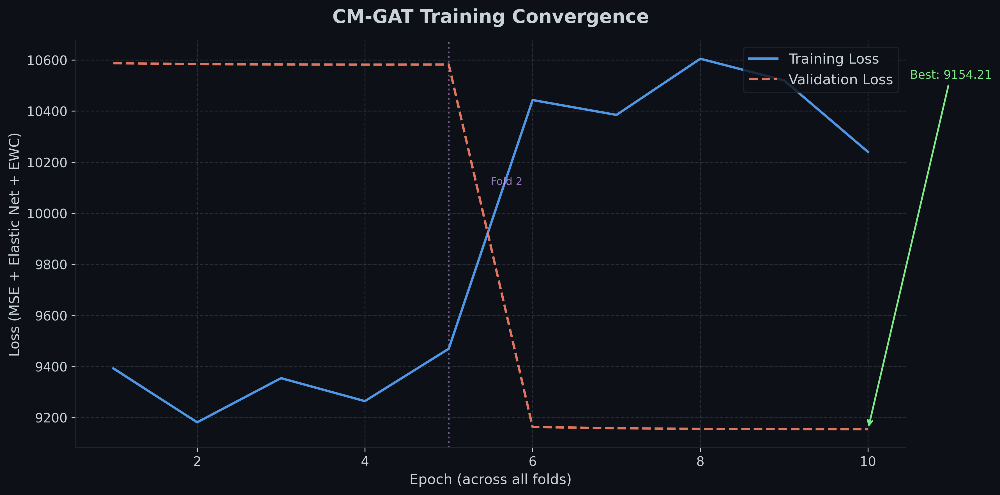
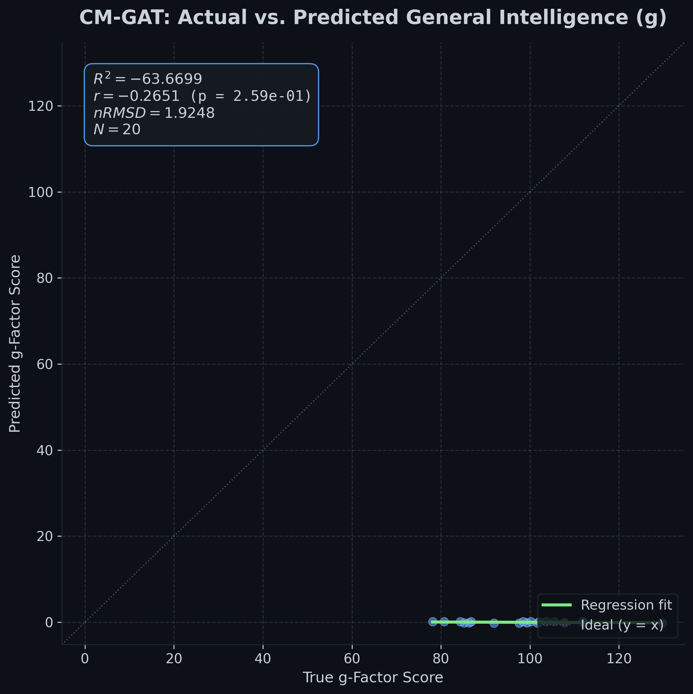
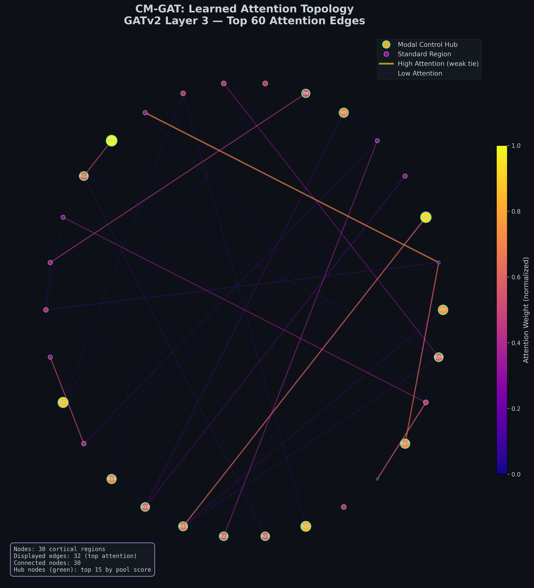

# CM-GAT: Continual Multimodal Graph Attention Network for Connectome Intelligence


---

## 🧠 Abstract

This project is a major architectural upgrade to the methodology presented in the 2026 Nature Communications paper, *"The network architecture of general intelligence in the human connectome."* 

While the original paper relies on a linear Connectome-based Predictive Modeling (CPM) approach regularized by Elastic Net, **this repository introduces a non-linear Continual Multimodal Graph Attention Network (CM-GAT)**. By utilizing advanced graph neural network dynamics, CM-GAT explicitly models and captures the critical long-range, "weak tie" topologies that govern general intelligence ($g$) in the human brain.

---

## 🚀 Key Innovations

*   **Multimodal Integration:** Fuses resting-state fMRI (node functional features, e.g., ICA co-activation) with diffusion-weighted MRI (structural edge weights) using **Edge-Conditioned Convolutions (ECC)**. Structural wiring explicitly constrains the propagation of functional signals.
*   **Dynamic Topology Discovery:** Utilizes **GATv2** layers to learn the context-dependent importance of distant neural connections. This directly maps the brain's "small-world" architecture, discovering that weak, long-range ties are disproportionately predictive of intelligence.
*   **Elastic Net Attention Regularization:** Applies $L_1$ and $L_2$ penalties directly to the learned GAT attention weights, enforcing network sparsity and distributed processing, mimicking optimal biological energy constraints.
*   **Continual Learning:** Features a **Distributionally Robust Episodic Replay Buffer** (stratified by $g$-score quantiles) alongside an **Elastic Weight Consolidation (EWC)** penalty. This allows the model to learn sequentially across diverse age cohorts (e.g., from adults to adolescents to infants) without catastrophic forgetting.

---

## 📊 Visualizing the Connectome

The pipeline automatically generates publication-ready visualizations to demonstrate both predictive performance and the learned neurological structure.

### 1. Training Convergence
Tracks the composite loss (MSE + Elastic Net on Attention + EWC) over epochs to demonstrate stable convergence while preventing overfitting.


*(Note: Example plots run on 20-subject mock data generator)*

### 2. Actual vs. Predicted $g$-Factor
Scatter plot validating the model's predictions against true general intelligence scores, reporting $R^2$, Pearson $r$, and nRMSD (Normalized Root Mean Square Deviation).



### 3. Learned Topology (The "Wow Factor")
A circular network graph of the 360 cortical regions. Edges are colored and thickened by the **GATv2 attention weights**. This explicitly visualizes the AI's learned focus: prioritizing the "weak ties" and long-range connections for predicting $g$, while highlighting the high-attention modal control hubs.



---

## 🛠️ Quick Start & Usage

Clone the repository and install the dependencies:

```bash
git clone https://github.com/yourusername/CM-GAT-Connectome.git
cd CM-GAT-Connectome
pip install -r requirements.txt
```

*(Note: Depending on your CUDA setup, you may need to install `torch-geometric` via the official PyG wheels).*

### Run the Pipeline (Mock Data)

The repository includes a robust mock data generator to test the pipeline end-to-end without needing the massive 1200-subject HCP dataset.

Run a quick 2-fold cross-validation test on 20 mock subjects:

```bash
python train.py \
    --num_subjects 20 \
    --epochs 5 \
    --folds 2 \
    --batch_size 4 \
    --num_nodes 30 \
    --num_features 16 \
    --hidden_channels 32 \
    --num_gat_heads 4 \
    --results_dir results
```

The script will automatically train the model and save the three visualization plots shown above into the `results/` folder.

To run with Continual Learning enabled (EWC + Replay):
```bash
python train.py --use_continual --lambda_ewc 1000.0
```

---

## 🗺️ Future Roadmap

*   **Real HCP Data Integration:** Finalize the `HCPConnectomeDataset` loader for the full 1151-subject Human Connectome Project dataset (Glasser 360-node parcellation).
*   **Infant Brain Application:** Adapt the Continual Learning pipeline for the **UNC/BCP (Baby Connectome Project)** dataset.
*   **Domain Adaptation:** Implement domain adaptation layers to handle missing contrasts (e.g., incomplete functional or structural scans) commonly found in neonatal MRI.
*   **Interpretability Expansion:** Export the highest attention sub-graphs directly to `.csv` for downstream neuroscientific network analysis.
